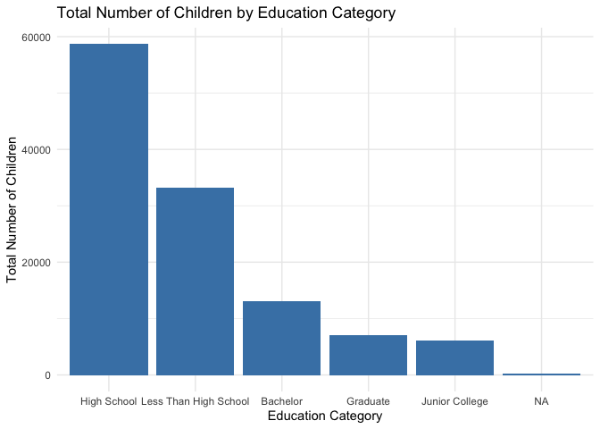
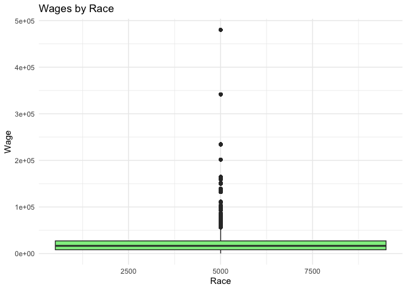

# Overview

Now that you’ve demonstrated knowledge of your software is setup, the
goal of this assignment is to practice transforming and visually
exploring data.

# Accessing your `a2` repository

- Go [to this link](https://classroom.github.com/a/gtGAnmOx) to accept
  and create your private `a2` repository on GitHub. Once you do so,
  your repository will be built in a few seconds. It follows the naming
  convention `a2-<USERNAME>`  
- Once the your repository has been created, click on the link you see,
  which will take you to your repository.
- Finally, clone the repository to your computer following the process
  below.

# Cloning your `a2` repository

After you have accessed the `a2` repository (see above), follow the
[same steps you completed for `a1`](/assignments/edit-readme/) to clone
the repository.

# General workflow

Your general workflow will be:

- Accept the repo and clone it (see above)
- Make changes locally to the files in RStudio
- Save your changes
- Stage-Commit-Push: stage and commit your changes to your local Git
  repo; then push them online to GitHub. You can complete these steps
  using the Git GUI integrated into RStudio. In general, you do not want
  to directly modify your online GitHub repo (if you do so, remember to
  pull first); instead modify your local Git repo, then
  stage-commit-push your changes up to your online GitHub repo.

Please notice for this assignment we expect you to do some more work in
terms of formatting and reproducibility: submit a homework that fully
complies with the [Homework
Guidelines](/faq/homework-guidelines/#homework-workflow).

<!-- NOTE: ADD THE GENERAL WORKFLOW STEPS ABOVE TO THE GENERAL WORKFLOW GUIDELINES AND REVEIW -->
<!-- # Exploring the mass shooting dataset -->
<!-- Your goal for this assignment is to apply what you have learned about data visualization and data exploration on a cleaned dataset that we provide: the "mass shooting" dataset. -->
<!-- The United States experiences far more mass shooting events than any other developed country in the world. While policymakers, politicians, the media, activists, and the general public recognize the widespread prevalence of these tragic events, policies intended to stop these events should be grounded in evidence and empirical data.  -->
<!-- In July 2012, in the aftermath of a mass shooting in a movie theater in Aurora, Colorado, -->
<!-- [Mother Jones](https://www.motherjones.com/politics/2012/07/mass-shootings-map/) published a report on mass shootings in the United States since 1982. Importantly, they provided the underlying data set as [an open-source database](https://www.motherjones.com/politics/2012/12/mass-shootings-mother-jones-full-data/) for anyone interested in studying and understanding this criminal behavior. -->

## Obtain the data

We’re going to use a dataset on wages, race, and gender.
<!-- I have included this dataset in the [`c3s2`](https://github.com/css-materials/rcis) library on GitHub.  -->

<!-- * If you are working on R workbench, you should have everything already installed. Simply load the library by typing in your console `library(c3s2)` and then load the dataset by typing `data("mass_shootings")`.  Use the help function in R `?mass_shootings` to get detailed information on the variables and coding information. -->

- If you are using R on your local computer, you first need to install
  the `stevedata` package. Type in your console
  `install.packages("stevedata")`. Then call `library(stevedata)`.

<!-- `remotes::install_github("MACS40700/c3s2")`. If you don't already have the `remotes` library installed, you will get an error. Go back and install this first using `install.packages()`, then install `remotes``. Finally, the mass shootings dataset can be loaded using `data("mass_shootings")`. Use the help function in R `?mass_shootings` to get detailed information on the variables and coding information. -->

## Explore the data

### Very specific questions

1.  Load and describe the dataframe ‘gss\_wages’
2.  Generate a data frame that summarizes the number of women and men
    per education category Print the data frame as a formatted `kable()`
    table (see below).
3.  Generate a bar chart that identifies the number of children
    associated with each education category. The bars should be sorted
    from highest to lowest.
4.  Generate a boxplot visualizing the wages of individuals, by race.

<!-- -->

    ## 
    ## Attaching package: 'dplyr'

    ## The following objects are masked from 'package:stats':
    ## 
    ##     filter, lag

    ## The following objects are masked from 'package:base':
    ## 
    ##     intersect, setdiff, setequal, union

    ##       year         realrinc           age            occ10     
    ##  Min.   :1974   Min.   :   227   Min.   :18.00   Min.   :  10  
    ##  1st Qu.:1985   1st Qu.:  8156   1st Qu.:32.00   1st Qu.:2710  
    ##  Median :1996   Median : 16563   Median :44.00   Median :4720  
    ##  Mean   :1996   Mean   : 22326   Mean   :46.18   Mean   :4696  
    ##  3rd Qu.:2006   3rd Qu.: 27171   3rd Qu.:59.00   3rd Qu.:6230  
    ##  Max.   :2018   Max.   :480144   Max.   :89.00   Max.   :9997  
    ##                 NA's   :23810    NA's   :219     NA's   :3561  
    ##   occrecode            prestg10         childs        wrkstat         
    ##  Length:61697       Min.   :16.00   Min.   :0.000   Length:61697      
    ##  Class :character   1st Qu.:33.00   1st Qu.:0.000   Class :character  
    ##  Mode  :character   Median :42.00   Median :2.000   Mode  :character  
    ##                     Mean   :43.06   Mean   :1.923                     
    ##                     3rd Qu.:50.00   3rd Qu.:3.000                     
    ##                     Max.   :80.00   Max.   :8.000                     
    ##                     NA's   :4186    NA's   :189                       
    ##     gender            educcat           maritalcat       
    ##  Length:61697       Length:61697       Length:61697      
    ##  Class :character   Class :character   Class :character  
    ##  Mode  :character   Mode  :character   Mode  :character  
    ##                                                          
    ##                                                          
    ##                                                          
    ## 

    ## tibble [61,697 × 11] (S3: tbl_df/tbl/data.frame)
    ##  $ year      : num [1:61697] 1974 1974 1974 1974 1974 ...
    ##   ..- attr(*, "label")= chr "GSS year for this respondent"
    ##   ..- attr(*, "format.spss")= chr "F4.0"
    ##  $ realrinc  : num [1:61697] 4935 43178 NA NA 18505 ...
    ##   ..- attr(*, "label")= chr "R's income in constant $"
    ##   ..- attr(*, "format.spss")= chr "F6.0"
    ##  $ age       : num [1:61697] 21 41 83 69 58 30 48 67 51 54 ...
    ##   ..- attr(*, "label")= chr "Age of respondent"
    ##   ..- attr(*, "format.spss")= chr "F2.0"
    ##  $ occ10     : num [1:61697] 5620 2040 NA NA 5820 ...
    ##   ..- attr(*, "label")= chr "R's census occupation code (2010)"
    ##   ..- attr(*, "format.spss")= chr "F4.0"
    ##  $ occrecode : chr [1:61697] "Office and Administrative Support" "Professional" NA NA ...
    ##  $ prestg10  : num [1:61697] 25 66 NA NA 37 45 59 49 28 38 ...
    ##   ..- attr(*, "label")= chr "R's occupational prestige score (2010)"
    ##   ..- attr(*, "format.spss")= chr "F8.0"
    ##   ..- attr(*, "display_width")= int 10
    ##  $ childs    : num [1:61697] 0 3 2 2 0 0 2 1 2 2 ...
    ##   ..- attr(*, "label")= chr "Number of children"
    ##   ..- attr(*, "format.spss")= chr "F1.0"
    ##  $ wrkstat   : chr [1:61697] "School" "Full-Time" "Housekeeper" "Housekeeper" ...
    ##  $ gender    : chr [1:61697] "Male" "Male" "Female" "Female" ...
    ##  $ educcat   : chr [1:61697] "High School" "Bachelor" "Less Than High School" "Less Than High School" ...
    ##  $ maritalcat: chr [1:61697] "Married" "Married" "Widowed" "Widowed" ...
    ##  - attr(*, "notes")= chr [1:80236] "document Since CAPI 2002 (Computer Assisted Personal Interview)" "         provides various information on the length of" "         interview time, there are three elasped interview time" "         variables newly added to the remp7202p.sys." ...

<table>
<caption>Number of Women and Men per Education Category</caption>
<thead>
<tr>
<th style="text-align: left;">educcat</th>
<th style="text-align: right;">Female</th>
<th style="text-align: right;">Male</th>
</tr>
</thead>
<tbody>
<tr>
<td style="text-align: left;">Bachelor</td>
<td style="text-align: right;">4878</td>
<td style="text-align: right;">4341</td>
</tr>
<tr>
<td style="text-align: left;">Graduate</td>
<td style="text-align: right;">2217</td>
<td style="text-align: right;">2382</td>
</tr>
<tr>
<td style="text-align: left;">High School</td>
<td style="text-align: right;">18238</td>
<td style="text-align: right;">13475</td>
</tr>
<tr>
<td style="text-align: left;">Junior College</td>
<td style="text-align: right;">2154</td>
<td style="text-align: right;">1477</td>
</tr>
<tr>
<td style="text-align: left;">Less Than High School</td>
<td style="text-align: right;">7025</td>
<td style="text-align: right;">5375</td>
</tr>
<tr>
<td style="text-align: left;">NA</td>
<td style="text-align: right;">79</td>
<td style="text-align: right;">56</td>
</tr>
</tbody>
</table>



    ## Warning: Continuous x aesthetic
    ## ℹ did you forget `aes(group = ...)`?

    ## Warning: Removed 3561 rows containing missing values or values outside the scale range
    ## (`stat_boxplot()`).

    ## Warning: Removed 20339 rows containing non-finite outside the scale range
    ## (`stat_boxplot()`).



### More open-ended questions

Answer the following questions. Generate appropriate figures/tables to
support your conclusions.

1.  How many white males with prior signs of mental illness initiated a
    mass shooting after 2000?
2.  How does the distribution of mass shooting fatalities differ between
    White and Black shooters? What about White and Latino shooters?
    &lt;!–
3.  Which month of the year has the most mass shootings? Generate a bar
    chart sorted in chronological order to provide evidence of your
    answer. –&gt;

### Very open-ended question

Answer the following question. Generate appropriate figures/tables to
support your conclusions. Provide 1-2 paragraphs of written
interpretation of your results. Graphs and/or tables alone will not be
sufficient to answer this question.

1.  Are mass shootings with shooters suffering from mental illness
    different from mass shootings with no signs of mental illness in the
    shooter? Your graphs should assess the relationship between mental
    illness and total victims, between mental illness and location type,
    and intersection of all three variables.

## Formatting Guide

### Formatting graphs

While you are practicing exploratory data analysis, your final graphs
should be appropriate for sharing with outsiders. That means your graphs
should have:

- [A title](http://r4ds.had.co.nz/graphics-for-communication.html#label)
- Labels on the axes (see `?labs` for details)

This is just a starting point. Consider adopting your own color scales,
[taking control of your legends (if
any)](http://www.cookbook-r.com/Graphs/Legends_(ggplot2)/), playing
around with
[themes](https://ggplot2.tidyverse.org/reference/index.html#section-themes),
etc.

### Formatting tables

When presenting tabular data (aka `dplyr::summarize()`), make sure you
format it correctly. Use the `kable()` function from the `knitr` package
to format the table for the final document. For instance, this is a
poorly presented table summarizing where gun deaths occurred:

    # calculate total gun deaths by location
    #count(mass_shootings, location_type)

Instead, use `kable()` to format the table, add a caption, and label the
columns:

    # count(mass_shootings, location_type) %>%
    #   kable(
    #     caption = "Mass shootings in the United States by location",
    #     col.names = c("Location", "Number of incidents")
    #  )

Run `?kable` in the console to see how additional options.

# Submit the assignment

To submit the assignment, simply push to your repository the last
version of your assignment before the deadline. Then copy your
repository URL (e.g., `https://github.com/css-fall22/hw2-brinasab`) and
submit it to Canvas under HW02 before the deadline.

Your assignment should be submitted as a R Markdown document `.Rmd`.
Need a refresher on R Markdown? [Read
this](http://rmarkdown.rstudio.com/lesson-1.html) or
[this](http://r4ds.had.co.nz/r-markdown.html).

Make sure to stage-commit-push: \* `mass-shootings.Rmd` (the main file
you will add your code to) \* `mass-shootings.md` (you will generate
this from the .Rmd by simply knitting it) \* `mass-shootings_files/`
(this folder contains all the graphs you generated in your `.Rmd`)

As part of your submission, write 1-2 paragraphs of reflections on what
was hard/easy about this homework, problems you solved and how, helpful
resources you consulted, etc. Please, list the first and last name of
eventual collaborators with whom you worked with to complete this
assignment.

<!--
Please notice for this assignment we expect you to do some more work in terms of formatting and reproducibility: submit a homework that fully complies with the [Homework Guidelines](/faq/homework-guidelines/#homework-workflow).
-->

# Rubric

Needs improvement: Displays minimal effort. Doesn’t complete all
components. Code is poorly written and not documented. Uses the same
type of plot for each graph, or doesn’t use plots appropriate for the
variables being analyzed. Shows incomplete understanding of the packages
needed for the assignment. No record of commits other than the final
push to GitHub.

Satisfactory: Solid effort. Hits all the elements. Minor omissions but
no clear mistakes. Easy to follow (both the code and the output). Shows
sufficient understanding of the packages needed for the assignment.

Excellent: Finished all components of the assignment correctly. Code is
well-documented (both self-documented and with additional comments as
necessary). Graphs and tables are properly labeled. Uses multiple
commits to back up and show a progression in the work. Analysis is clear
and easy to follow, either because graphs are labeled clearly or you’ve
written additional text to describe how you interpret the output. Shows
solid understanding of the packages needed for the assignment.

For further details, see the [general
rubric](/faq/homework-evaluations/) we adopt for grading.

<!-- # Acknowledgments -->
<!-- # ```{r child = here::here("R", "_ack_ben.Rmd")} -->
<!-- # ``` -->
<!--
[^clean]: For the purposes of this assignment, some data cleaning of the underlying raw data have been performed. You can view the data cleaning code [here](https://github.com/cis-ds/rcis/blob/master/data-raw/mass-shootings.R).
-->
