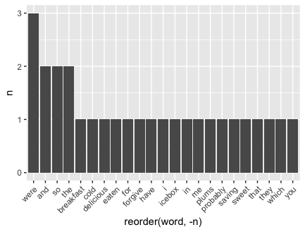

```{r setup, include = FALSE}

xaringanExtra::use_panelset()
```

```{r pkgs, include = FALSE, cache = FALSE}
options(htmltools.dir.version = FALSE)

library(tidyverse)
library(tidytext)
library(scales)
library(here)
library(patchwork)
library(magrittr)
library(countdown)

set.seed(1234)
theme_set(theme_minimal(base_size = 16))
```

# Agenda

* Reminder: Regular Expressions
    * basic understanding of how it workds
    * intro to stringr package 
* Workflow for text analysis  
    * Three examples:
        * Emily Dickinson (basic process with small example)
       * Jane Austen (more complex example with some analysis)
       * Billboard hot 100: merging data, answering quesitons, building workflow

---
class: inverse, middle

# Blast from the past!
## Regular Expressions
[refreser: revisit old slides if needed](https://cfss-macss.netlify.app/slides/32-strings/#1)


---

### What are regular expressions? Why are they for?

We use them to manipulate character data, aka strings. 

Regular Expressions or regexes (singular regex): **language for pattern matching**. They are strings containing normal characters and special meta-characters that describe a particular pattern that we want to match in a given text.

Regular Expressions are used:

* in **many programming languages**
* for **any task that deals with text:** NLP or data-cleaning tasks (e.g., find words that include a given set of letters, how often do past tenses occur in a text, find emails or phone numbers, find and replace left over HTML tags from scraping, etc.).

<!--
Given our ability to manipulate strings and our ability to test for equivalence (==) or test whether some string contains another (in), we don't technically need special functions for pattern matching (e.g. regular expressions). That said, it becomes very tedious very quickly if we have to write all our pattern-matching code ourselves
-->


---
# Regex: how we match

* **Anchors**: match a position before or after other characters
* **Types**: matching types of characters
* **Classes**: ranges or sets of characters
* **Quantifiers**: specify how it matches
    * **Repetition**: matching more than a single instance
    * **Patterns and backreferences**: can name and extract specific chunks
* **Lookahead**: specify that certain elements must appear before your chunk (regardless of whether it appears within it)
* **Literal matches and modifiers**: you can specify particular matches (e.g. case)
* **Unicode**: particularly useful if you're working with other languages

---
# Regex: lazy vs greedy

Examples of Lazy or Non-Greedy quantifiers are `??`, `*?`, `+?`, and `{}?`:

* They match as few characters as possible, and stop at the first recurrence of a character (e.g., the regex moves forward through the string one character at a time, and stops at the first match)
* Example: the regex `a+?` will match as few "a" as possible in the string "aaaa". Thus, it matches the first character "a" and is done with it

---

### Regex examples

Examples: download today's in-class materials from the website: `usethis::use_course("CFSS-MACSS/text-analysis-fundamentals")`

Resources:
* [stringr cheat sheet](https://evoldyn.gitlab.io/evomics-2018/ref-sheets/R_strings.pdf) for a complete overview of all `stringr` functions
* [Chapter 14 "Strings" of R for Data Science](https://r4ds.had.co.nz/strings.html#strings), especially section 14.4 "Tools" for examples of each of these functions
* [Regular expressions cheat sheet](https://www.datacamp.com/cheat-sheet/regular-expresso)
* [Excellent (but a bit complex) tutorial](https://github.com/ziishaned/learn-regex/blob/master/README.md)
* [Transform Strings slides](https://cfss-macss.netlify.app/slides/32-strings/#1)

---

### The `stringr()` package in R

When you use regular expressions for your analysis, most likely you will need to use your regular expression together with one of the functions from the `stringr()` package. 

This package includes several functions that let you: detect matches in a string, count the number of matches, extract them. replace them with other values, or split a string based on a match. 

---

### The `stringr()` package in R

Fundamental `stringr()` functions:

`str_detect()`: detect matches in a string
`str_count()`: count the number of matches
`str_extract()` and `str_extract_all()`: extract matches
`str_replace()` and `str_replace_all()`: replace matches
`str_split()`: split a string based on a match

Key resources:
* [Chapter 14 "Strings" of R for Data Science](https://r4ds.had.co.nz/strings.html#strings), especially section 14 for examples of each of these functions
* [Cheat sheet](https://evoldyn.gitlab.io/evomics-2018/ref-sheets/R_strings.pdf)

---

class: inverse, middle

# Basic workflow for text analysis

---

## Basic workflow for text analysis

We can think at the basic workflow as a 4-step process:

1. Obtain your textual data

1. Data cleaning and pre-processing 

1. Data transformation

1. Perform analysis

Let's review each step...

---
class: inverse, middle


*Source: [Text Mining with R](https://www.tidytextmining.com/tidytext.html#the-unnest_tokens-function)*
---

## 1. Obtain your textual data

**Common data sources for text analysis:**

* Online (Scraping and/or APIs)
* Databases
* PDF documents
* Digital scans of printed materials

---

## 1. Obtain your textual data

**Corpus and document:**

* Textual data are usually referred to as **corpus**: general term to refer to a collection of texts, stored as raw strings (e.g., a set of articles from the NYT, novels by an author, one or multiple books, etc.)

* Each corpus might have separate articles, chapters, pages, or even paragraphs. Each individual unit is called a **document**. You decide what constitutes a document in your corpus. 

---

## 2. Data cleaning and pre-processing

**Standard cleaning and pre-processing tasks:**

* Tokenize the text (to n-grams)
* Convert to lower case
* Remove punctuation and numbers
* Remove stopwords (standard and custom/domain-specific)
* Remove or replace other unwanted tokens
* Stemming or Lemmatization 

---

## 2. Data cleaning and pre-processing

**Tokenize the text (to n-grams) mean splitting your text into single tokens**. 

**Token:** word, alphanumeric character, !, ?, number, emoticon etc.

Most tokenizers split on white spaces, but they need also consider exceptions such as contractions (I'll, dog's), hyphens in or between words (e-mail, co-operate, take-it-or-leave, 30-year-old).

**N-gram:** a contiguous sequence of n items from a given text (items can be syllables, letters, words, etc.). We usually keep unigrams (the single word), but there instances in which bigrams are helpful: for example "Taylor Swift" is a bi-gram.  
---

## 2. Data cleaning and pre-processing

**Remove stopwords** (standard and custom/domain-specific) 
* Examples: the, is, are, a, an, in, etc.
* Why we want to remove them? 
* Example: if you are working on a corpus that talks about "President Biden" you might want to add "Biden" among your stop words

---

## 2. Data cleaning and pre-processing

**Stemming** and **lemmatization** are similar in that both aim at simplifying words (aka tokens) to their base form but they do it differently. Why do we want to do it?

--

**Stemming:** reducing a token to its **root stem** by brutally removing parts from them 
* Examples: dogs become dog, walked becomes walk
* Faster, but not always accurate. Example: caring becomes car, changing becomes chang, better becomes bett

**Lemmatization:** reducing a token to its **root lemma** by using their meaning, so the token is converted to the concept that it represents
* Examples: dogs become dog, walked becomes walk, 
* Slower, but more accurate. Example: caring becomes care, changing becomes change, better becomes good

---

## 2. Data cleaning and pre-processing

More advanced pre-processing tasks (only applied to specific analyses):

* POS or Part-Of-Speech tagging (nouns, verbs, adjectives, etc.) 
* NER or Named Entity Recognition tagging (person, place, company, etc.)
* Parsing

---

## 3. Data transformation

Transformation means *converting the text into numbers*, e.g. some sort of quantifiable measure that a computer can process.

Usually you want to transform your raw textual data (your document) into a vector of countable units:

* Bag-of-words model: creates a document-term matrix (one row for each document, and one column for each term)
* Word embedding models

---

## 4. Perform analysis

We will learn the following:

* Basic exploratory analysis
    * Word frequency
    * TF-IDF (weighted version of word frequency)
    * Correlations
    
* More Advanced
    * Sentiment analysis
    * Topic modeling

---
# Motivating example 1: Emily Dickinson

We can think at the basic workflow as a 4-step process:

1. Obtain your textual data: *This is just to say*

1. Data cleaning and pre-processing  *(simple)*

1. Data transformation *transform one token per row* [see next slides!]

1. Perform analysis *basic histogram*

---
class: inverse, middle

# WARNING: GRAPHICS ARE NOT NICELY FORMATTED!!
*do as I say, not as I do!*

---
## Poem: This is just to say

```
This Is Just To Say

By William Carlos Williams
I have eaten
the plums
that were in
the icebox

and which
you were probably
saving
for breakfast

Forgive me
they were delicious
so sweet
and so cold

```
---
## Analysis: what does this mean?

```{r echo=FALSE, fig.cap="Histogram of text from exercise 1", out.width = '60%', dpi = 300}


```

---

class: inverse, middle

# Text analysis with R tidyverse 


---

### The tidy text format

There are different ways to complete all steps in R, and different packages have their own approach. We learn how to perform these operations within the tidyverse. 

For the data cleaning and pre-processing step: we start by converting text into a tidy format, which follows the same principle of tidy analysis we have learned so far.


---

### The tidy text format

A tidy text format is defined as **a table with one-token-per-row** (this is different from the document-term matrix, which has one-document-per-row and one-term-per-column).

Steps:

* take your text
* put into a tibble
* convert into the tidy text format using `unnest_tokens()` 
  * punctuation is automatically removed
  * lower case is automatically applied

See [`tidytext`](https://github.com/juliasilge/tidytext) for more info

---
## Example 2: Jane Austen example (more complex)

We're going to move onto our next example, using Jane Austen's novels. Now that we have a lot more text to work with, we need to do a bit more cleaning. 
--
Recall the following graphic:


---
## Example 2: Jane Austen example (more complex)

Now, if we were to follow and replicate what we did in example one, we'd end up with this:

--
```{r echo=FALSE, fig.cap="Histogram of text without stop words", out.width = '50%', dpi = 500}
knitr::include_graphics("https://www.tidytextmining.com/01-tidy-text_files/figure-html/plotcount-1.png")

```

---
## Tidy text: Stop words

## **HOW TO ELIMINATE STOP WORDS?**    
--
We have a dataset of stop words we can use, but how?!

```{r}
library(tidytext)
data(stop_words)
head(stop_words)
```

--
ANTI JOIN!!!


---
### Removing stop words with an anti join
```{r, eval=FALSE}
# remove stop words with anti_join()
data(stop_words)
tidy_books <- tidy_books %>%
  anti_join(stop_words)
```

--
<!-- # ```{r echo=FALSE, fig.cap="Histogram of text containing stop wordws", out.width = '40%', dpi = 300} -->
<!-- # knitr::include_graphics(here("static", "img", "austen.png")) -->
<!-- #  -->
<!-- # ``` -->

---
# COOL!! NOW WHAT?!!!

Once you have your data, you can start looking at the text to get a sense of what's there, what isn't there, and then can move into multiple future directions:

* What words are and are not there (ex: authorship of Federalist documents)
* What words are connected to one another and are not (ex: Garkov)    
--
* What ideas / themes ... **TOPICS** come up
* The overall feelings (**SENTIMENT**) in the text

---

## Example: building on this (next steps)


.panelset[
.panel[.panel-name[Plot of books]
```{r echo=FALSE, fig.cap="By book analysis from Austen", out.width = '60%', dpi = 300}
knitr::include_graphics("https://www.tidytextmining.com/02-sentiment-analysis_files/figure-html/sentimentplot-1.png")
```
]
.panel[.panel-name[Table of Books]
```{r echo=FALSE, fig.cap="By book analysis from Austen", out.width = '60%', dpi = 300}
library(tidyverse)
library(knitr)

read.csv("austen_bybooks.csv") %>% kable()
```
]
]

---

# TIME TO FLY FREE! Example 3
In groups: work through the example below and see what you learn.    

**Example 3:** How often is each U.S. state mentioned in a popular song? We’ll define popular songs as those in Billboard’s Year-End Hot 100 from 1958 to the present. Data from  Billboard Year-End Hot 100 (1958-present) and the Census Bureau ACS

---
### Recap: The tidy text format

Examples of basic exploratory text analysis using R tidyverse.
These examples all in your in-class materials for today and might be useful for your final project and optional A7.

**Example 1:** from book "1.2 Emily Dickinson example"

**Example 2:** from the book "1.3 Jane Austen example"

**Example 3:** How often is each U.S. state mentioned in a popular song? We’ll define popular songs as those in Billboard’s Year-End Hot 100 from 1958 to the present. Data from  Billboard Year-End Hot 100 (1958-present) and the Census Bureau ACS

**More examples available** in the assigned readings and suggested resources 

---
# Recap

* Regex: how we can deal with text. Need this to find particular terms, have a basic understanding of text. 

* Workflow: multiple steps -- need to start thinking about the process and the complexity of your text can be crucial for your success. 

---
## Acknowledgments 

The content of these slides is derived in part from Sabrina Nardin and Benjamin Soltoff’s "Computing for the Social Sciences" course materials, licensed under the CC BY NC 4.0 Creative Commons License. Any errors or oversights are mine alone.